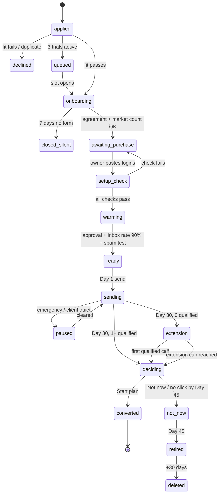

# Aviance Trial Machine — Build Specification

Sep 24, 2026 · @limethsith

This is the build spec for the system described in the plan. It is written to be handed to Claude Code and built inside the existing `email-distributor` repository. Everything here runs without a human or a Claude session once deployed.

## 1. Purpose and rules

**What this builds.** A multi-client trial engine inside `email-distributor` (Next.js 14 App Router, Upstash Redis via `@vercel/kv`, nodemailer SMTP, imapflow IMAP, GitHub Actions heartbeat). It takes a prospect from "yes" to Day 45 of the Aviance 30-Day Trial with about 20 minutes of owner time per trial and no AI chat session anywhere in the loop. A parent layer, **Mission Control**, shows every trial and its state on one screen.

**How to use this spec.** Build in the phase order of section 15. Each system in sections 6–10 has: purpose, trigger, inputs, steps, outputs, failure handling, and the config keys it reads (section 12). Where a template email is named, its text comes from the owner's file *The 30-Day Trial.docx*, Section 10, and the Free Trial SOP folder; copy those verbatim into `src/lib/templates/`. Nothing in this spec should be invented at build time: where a value or wording is missing, use the default in section 12 or 16 and log it in `docs/ASSUMPTIONS.md`.

**The seven rules the code must obey**

1. **No silent failure.** Every job either succeeds, self-heals, or emits an owner alert (section 11). A caught exception with no alert is a bug.
2. **No subscriptions.** Only per-trial spend is the domain and inboxes. Every service used must be on a free tier or one-time credit (section 13). No paid API keys in `.env`.
3. **No Claude at runtime.** All text comes from templates + rules. No LLM calls. No AI feature flag.
4. **Never invent a number.** Reports render only from stored counters. A missing counter blocks the report and alerts the owner; it never renders as 0 or a guess.
5. **Idempotent everything.** Every scheduled job and webhook can run twice with no double send, double email, or double count. Use `SET NX` claims and per-day keys (section 5).
6. **Hand up, never drop.** A reply that no rule can classify goes to the client as a hot lead. A legal/angry reply goes to the owner. A job that cannot complete leaves state unchanged and alerts.
7. **Per-client isolation.** Every key, inbox, lead, reply and email is scoped by `clientId`. A cross-client read is a bug. The suppression list is the one global exception (a STOP applies to all clients).

**Vocabulary.** *Client* = the trial company. *Prospect* = a person on the client's list. *Owner* = you (Aviance). *Trial day* = days counted from first send (Day 1); build days are negative (Day −14 = signed). *Tick* = one heartbeat call. *System* = one module under `src/lib/systems/`.

## 2. Architecture

One app, one database, one repo. Every trial is a record inside it. The **mother system** is Mission Control: a set of admin pages plus the Notifier and Watchdog that sit above every client. The heartbeat drives everything; the app cannot tick itself.

```mermaid
flowchart TD
  P1[cron-job.org<br/>every 1 min] --> HB[/api/cron/tick]
  P2[GitHub Actions<br/>every 5 min backup] --> HB
  HB --> SCH[Scheduler<br/>section 5]
  SCH --> SYS[Systems A-D<br/>per client]
  SYS --> KV[(Upstash Redis)]
  SYS --> SMTP[Gmail SMTP/IMAP<br/>trial inboxes]
  SYS --> EXT[Google Places / OSM<br/>Reoon / DNS]
  SYS --> NOTE[Notifier]
  NOTE --> OWN[Owner: email + Telegram]
  NOTE --> CLI[Client: email + pages]
  HB --> HC[Healthchecks.io ping]
  MC[Mission Control UI] --> KV
  LF[Lead Finder job<br/>GitHub Actions] --> KV
```

Reading it: two independent pingers call the same tick endpoint; the scheduler decides which client jobs are due; systems read and write Redis and talk to inboxes and free data sources; the Notifier is the only thing that emails a human. The Lead Finder runs as a separate GitHub Actions job because it needs minutes, not seconds.

**Runtime pieces**

| Piece | Where | Role |
| --- | --- | --- |
| Web app | Next.js 14 on Vercel (or the host chosen in section 16) | Admin UI, client pages, API routes, tick endpoint |
| Database | Upstash Redis (free tier) | All state, keyed per client (section 3) |
| Heartbeat A | cron-job.org, every minute, `Authorization: Bearer CRON_SECRET` | Primary tick |
| Heartbeat B | GitHub Actions `*/5 * * * *` + weekly keep-alive commit | Backup tick; keeps schedule alive |
| Dead-man alarm | Healthchecks.io (free, 20 checks) | Alerts owner if no tick for 15 min |
| Lead Finder | GitHub Actions workflow, dispatched by the app via `repository_dispatch` | Long-running list build; writes results back through `/api/leads/bulk` |
| Backup | GitHub Actions nightly: `GET /api/admin/export` → commit to private `aviance-backups` repo | Daily snapshot of Redis |
| Client pages | `/c/[token]/...` signed-token routes | Onboarding, approval, decision, one-tap buttons |
| Owner alerts | Email (from the owner's own inbox) + Telegram bot (free) | Section 11 |

**Code layout (new and changed)**

```markdown
src/lib/systems/        one file per system, named as in sections 6-10
src/lib/scheduler.js    tick dispatcher (section 5)
src/lib/db/             keys.js (section 3), client.js, trial.js, leads.js, replies.js, bookings.js
src/lib/templates/      every email and page text, keyed by name (section 11)
src/lib/config.js       every threshold (section 12), overridable per client
src/lib/notify.js       Notifier (owner + client channels)
src/app/api/cron/tick/route.js          single heartbeat entry
src/app/api/webhooks/leadfinder/route.js  results from the Actions job
src/app/c/[token]/...                   client pages
src/app/mc/...                          Mission Control (admin, behind ADMIN_SECRET)
.github/workflows/heartbeat.yml, leadfinder.yml, backup.yml, keepalive.yml
```

**What changes in the existing code.** `smtp-accounts.js` reads inboxes from Redis (`inbox:{clientId}:{email}`), encrypted, instead of env vars; env `SMTP_ACCOUNT_*` stays supported for client `aviance` only. `auto-send` becomes a system called by the scheduler with a `clientId` and reads that client's leads, inboxes, sequence and caps. `reply-checker.js` gains the classifier and hands results to the Reply Handler. `daily-report.js` is generalised into the report renderer. `metrics.js` loses the hard-coded `CAMPAIGNS`, `CAMPAIGN_START` and tracking-gap constants; those become per-client fields.

## 3. Data model

All keys live in one Redis database and start with the client id. `clientId` is a short slug (`acme-plumbing`). The owner's own outreach is `clientId = aviance`. All timestamps are ISO strings in UTC. All counters are integers. Define every key in `src/lib/db/keys.js`; nothing else builds key strings by hand.

| Key | Type | Holds |
| --- | --- | --- |
| `clients` | set | every clientId |
| `client:{id}` | hash | `name, contactName, contactEmail, website, mainDomain, plan (trial/starter/growth/scale), state (section 4), createdAt, ownerNotes` |
| `client:{id}:profile` | hash | Form answers: `sellsTo, industry, cities[], states[], sizeMin, sizeMax, titles[], excludedTitles[], dreamCustomers[3], calendarUrl, postalAddress, senderName, senderTitle, senderPrefix, capacityPerWeek, winCondition, usHours` |
| `client:{id}:trial` | hash | `agreementAcceptedAt, agreementName, agreementIp, signedDay (Day −14 date), day1Date, day30Date, extensionUntil, endedAt, endReason, decision (plan/talk/notnow/none), decisionAt, bonusExpiresAt, reviewRequestedAt, reviewLink, exitReason, handoverSentAt, dataDeleteAt` |
| `client:{id}:domain` | hash | `name, registrar, purchasedAt, price, autoRenew (must be false), forwardsTo, spf, dkim, dmarc (pass/fail + checkedAt each), blacklist (clean/listed + checkedAt), retiredAt` |
| `client:{id}:inboxes` | set | inbox emails for this client |
| `inbox:{id}:{email}` | hash | `displayName, passwordEnc, provider, smtpHost, smtpPort, imapHost, imapPort, enabled, dailyCap, rampStage, warmupStartedAt, inboxRate7d, health (from inbox-health.js), lastSendAt, lastImapAt, twoStepVerified` |
| `client:{id}:shopping` | hash | Price Scout output: `domainCandidates[], chosenDomain, registrarQuotes[], inboxQuotes[], total, sentAt, boughtAt, unconfirmed[]` |
| `client:{id}:leads` | hash | `email -> lead JSON` (existing shape from `leads-db.js` + `clientId, source, score, dreamMatch, sanityChecked, riskLevel, tz, sequenceVariant`) |
| `client:{id}:leads:index:{status}` | set | fast lookups: `unsent, in_sequence, replied, bounced, suppressed, notnow` |
| `client:{id}:blocklist` | set | domains + emails of customers, competitors, partners |
| `suppression:global` | set | every email that said STOP/no/unsubscribe, any client, forever |
| `client:{id}:replies` | hash | `replyId -> {leadEmail, inbox, receivedAt, subject, snippet, kind (interested/question/notnow/no/ooo/wrongperson/angry/legal/unclear/bounce), handledAt, action, forwardedToClientAt, notnowDate}` |
| `client:{id}:bookings` | hash | `bookingId -> {leadEmail, scheduledAt, source (link/manual), remindersSent[], status (booked/held/noshow/rebooked/wrongfit/disputed), attendedTapAt, qualified (bool), disputeReason, rebookAttempts, threadForwardedAt, quote, quoteApprovedAt}` |
| `client:{id}:counters:{YYYY-MM-DD}` | hash | per day: `sent, sentD0, sentD3, sentD7, sentD10, bounces, replies, positive, booked, held, qualified, warmupSent, warmupInbox, warmupSpam` |
| `client:{id}:counters:total` | hash | running totals of the same fields + `companiesContacted` |
| `client:{id}:sequence` | hash | `variantA (JSON of 4 emails), variantB, active (A/B/both), approvedAt, approvedBy, approvalMode (click/silence), version` |
| `client:{id}:events` | list (capped 5000) | black box log lines: `{at, system, event, detail}` |
| `client:{id}:promises` | hash | Promise Register: `promiseId -> {text, dueAt, madeAt, doneAt}` |
| `client:{id}:report:{name}` | hash | rendered reports: `friday:{date}, day29, market, handover` with `renderedAt, html, text, blockedReason` |
| `client:{id}:token:{purpose}` | string | signed page tokens (onboarding, approval, decision, tap:{bookingId}) with TTL |
| `pacing`, `inbox_health`, `mx_verify` | existing | keep, but pacing keys become `pacing:{id}` |
| `warmup:pool` | set | every inbox in the warm-up circle (helper accounts + all active client inboxes) |
| `warmup:helper:{email}` | hash | same shape as an inbox record, `clientId = _helper` |
| `warmup:pair:{date}` | hash | who emailed whom today, to avoid repeats |
| `usage:{service}:{YYYY-MM}` | hash | Usage Meter counters: `redisCommands, placesEnterprise, reoonChecks, vercelInvocations` |
| `system:heartbeat` | hash | `lastTickAt, lastTickSource (cronjob/github), ticksToday, lastSendAt` |
| `system:alerts:{YYYY-MM-DD}` | set | alert keys already sent today (dedupe) |
| `learning:{niche}` | hash | Learning Library: `variant -> {sends, replies, positive, booked}` |
| `queue:trial` | list | waiting applicants when 3 trials are active |
| `jobs:claim:{jobName}:{scope}:{period}` | string (NX, TTL) | idempotency claims (section 5) |

**Lead record additions.** `tz` is derived from the state/city at import (`America/New_York`, `America/Chicago`, `America/Denver`, `America/Los_Angeles`, else Eastern). `riskLevel` is `safe / risky / catchall` from verification. `dreamMatch` is 0–3: how many of the client's three dream customers this company resembles (same industry keyword + same size band + same state).

**Deletion.** `client:{id}:*` is deleted 30 days after `trial.endedAt` by the Wrap-up system (section 9), except `client:{id}` (kept with `state = deleted` and `mainDomain` for the one-trial-per-company rule) and `learning:*` (aggregate only, no personal data).

## 4. The trial state machine

`client.state` is the single source of truth for where a trial is. Every system checks state before acting, and only the transitions below are legal. A transition writes an event to `client:{id}:events` and, where marked, a notification.



| State | Meaning | Day clock |
| --- | --- | --- |
| `applied` | Application received, Gatekeeper running | — |
| `declined` | Failed fit or duplicate; reason emailed | terminal |
| `queued` | Fit passed, 3 trials active; position + expected date emailed | — |
| `onboarding` | Onboarding link sent; waiting for form + agreement | reminders Day +2, +4; close at +7 |
| `closed_silent` | Never completed onboarding | terminal |
| `awaiting_purchase` | Shopping list sent to owner | reminder after 12 h |
| `setup_check` | Logins pasted; DNS, IMAP/SMTP, blacklist, redirect being verified | minutes |
| `warming` | Day −14 set = `signedDay`; warm-up running; list + copy being built | Day −14 → −1 |
| `ready` | Approval, inbox rate and spam test all green; waiting for next US weekday 9 AM ET | — |
| `sending` | Day 1–30; all Stage C systems active | `day1Date` set on first send |
| `paused` | Sending halted by Emergency Runner or Client Watch; warm-up continues | clock keeps running |
| `extension` | Day 30 passed with 0 qualified calls; free sending continues | until first qualified or cap (60 sending days total) |
| `deciding` | Day 29 report + Day 30 decision page sent; waiting for click | bonus expires 24 h after page sent |
| `converted` | Start plan clicked; Paid-plan starter takes over (`plan` changes) | — |
| `not_now` | Not now clicked, or no click by Day 45; follow-up ladder runs | Days 33, 37, 44 |
| `retired` | Domain and inboxes retired; owner told to cancel inboxes | Day 45 |
| `deleted` | Client data purged | `endedAt + 30 days` |

**Day arithmetic.** `trialDay(client, now)` = calendar days between `day1Date` and `now` in US Eastern, +1. Before `day1Date` it is negative, counted from `signedDay` (so the day after signing is Day −13). Every dated job in section 5 uses this function; nothing else computes days.

**Guards that apply in every state**

- `suppression:global` is honoured everywhere, always.
- A client in `paused`, `deciding`, `not_now`, `retired`, `deleted`, `declined` or `closed_silent` never sends a cold email.
- Warm-up runs in `warming`, `ready`, `sending`, `paused`, `extension` and stops in every other state.
- At most `MAX_ACTIVE_TRIALS` (3) clients may be in `onboarding` through `extension`; the Gatekeeper enforces it and `queued` waits.

## 5. The scheduler

One endpoint, `GET /api/cron/tick`, is called every minute by cron-job.org and every 5 minutes by GitHub Actions. It must finish in under 25 seconds (cron-job.org's 30-second cut-off), so each tick does a bounded amount of work and leaves the rest for the next tick. It requires `Authorization: Bearer CRON_SECRET`; without it, 401.

**What one tick does, in order**

1. Write `system:heartbeat.lastTickAt` and source. Ping Healthchecks.io (`HC_PING_URL`) at the end of a successful tick only.
2. Load `clients` and each `client:{id}` hash (one pipeline).
3. For each client in an active state, run the **minute jobs** that are due, cheapest first, with a 20-second overall budget. Stop and return when the budget is spent; the next tick continues.
4. Run the **global jobs** that are due.
5. Return `{ran: [...], skipped: [...], ms}`.

**Idempotency.** Every job that must run at most once per period claims `jobs:claim:{job}:{scope}:{period}` with `SET NX EX`. Period is `YYYY-MM-DD` for daily jobs, `YYYY-MM-DDTHH:mm` for minute jobs, or a stable id (`booking:{id}`) for one-shot events. Claim first, act second, never release on failure (the alert path handles retries). A send additionally claims the lead (`SET NX` on `lead:{clientId}:{email}:claim`, 5 min TTL) exactly as `auto-send` does today.

**Job table**

| Job | Scope | When (US Eastern unless stated) | System | Budget |
| --- | --- | --- | --- | --- |
| `send` | client | every tick, 8:00–19:00 Mon–Fri, only in `sending`/`extension`, and only when the lead's own tz is 9:00–17:00 | Sender | 1 email per inbox per tick, respecting pacing |
| `replies` | client | every tick 8:00–19:00 weekdays; every 20 min otherwise | Reply Handler (Speed Responder) | 1 inbox per tick, round-robin |
| `warmup` | global | every 10 min, 7:00–22:00 in the inbox's tz | Warm-up Engine | 3 pairs per tick |
| `warmup-read` | global | every 30 min | Warm-up Engine | reads, replies, rescues |
| `bounces` | client | daily 13:00 UTC (existing) + after every `send` error | Sender | — |
| `ramp` | client | daily 00:05 | Ramp Planner | sets `dailyCap` per inbox |
| `canary` | client | daily 07:30 | Canary Test | 1 email per inbox |
| `auth` | client | daily 06:00 + before Day 1 | Auth Guard | DNS + DMARC report parse |
| `blacklist` | client | daily 06:10 | Auth Guard | — |
| `pace` | client | Days 3, 7, 12, 15, 20, 25 at 18:00 | Pace Checks | — |
| `emergency` | client | every tick | Emergency Runner | reads counters only |
| `client-watch` | client | hourly | Client Watch | — |
| `bookings` | client | every 5 min | Booking Watcher | IMAP scan for calendar mails |
| `reminders` | client | every 5 min | Booking Watcher | 24 h / 1 h reminders |
| `noshow` | client | hourly | Call Scorekeeper | re-book ladder |
| `notnow` | client | daily 09:00 | Not-Now Date Reader | due follow-ups |
| `friday` | client | Fridays 09:00, from Day −14 | Friday Update | — |
| `day-jobs` | client | daily 09:00 | Trial Manager | Day −7 build check, Day 1 notice, Day 20 disposition, Day 29 report, Day 30 decision, Day 33/37/44 ladder, Day 45 retire, +30 delete |
| `onboarding-nudge` | client | daily 10:00 | Trial Gatekeeper | Day +2/+4 reminders, +7 close |
| `purchase-nudge` | client | hourly | Price Scout | 12 h reminder |
| `leadfinder-refill` | client | daily 02:00 | Lead Finder | dispatch if unsent < 50 |
| `usage` | global | hourly | Usage Meter | — |
| `morning` | global | daily 08:00 Asia/Colombo | Notifier | owner digest |
| `monday` | global | Mondays 08:00 Asia/Colombo | Notifier | KPI digest |
| `backup-export` | global | nightly, called by Actions | Watchdog | JSON export |
| `keepalive` | global | weekly, Actions commit | Watchdog | — |

**Time zones.** Sending hours use the lead's `tz`. Owner digests use `Asia/Colombo`. Everything else uses `America/New_York`. Use the existing `etParts` helper generalised to `partsIn(tz, date)`. US federal holidays come from a static list in `config.js` (10 dates per year, updated yearly by a one-line change).

**Failure inside a tick.** Wrap each job in try/catch. On error: log to `client:{id}:events`, increment `system:errors:{job}:{date}`, and if the same job has failed 3 ticks in a row, emit alert `job_failing` (section 11). Never let one client's error stop another client's jobs.

## 6. Stage A — Intake systems

Stage A takes a prospect from application to a warmed, verified setup. Order of flow: Gatekeeper → Onboarding page → Market Counter → Price Scout (+ Promo Hunter, optional Auto-Buyer) → owner purchase → Setup Checker (+ Auth Guard) → Booking Link Tester. State moves `applied → onboarding → awaiting_purchase → setup_check → warming`.

### 6.1 Trial Gatekeeper — `systems/gatekeeper.js`

**Purpose.** Decide within one business day whether an applicant gets a trial, a queue place, or a no with a reason. Enforce one trial per company, ever, and the 3-at-a-time cap.

**Trigger.** `POST /api/apply` (public form on aviance.online, or the owner's "New client" button which creates the record pre-approved) and the daily `onboarding-nudge` job.

**Inputs.** The nine application answers from *The 30-Day Trial* Section 2: website, US-based, employees, deal value, sold-to-strangers (yes/no), 3 dream customers, can meet within 5 business days, slots per week, someone else cold-emailing them (yes/no), agrees to the review ask.

**Steps.**

1. Normalise `mainDomain` from the website. Look up every `client:*` with the same `mainDomain` (including `state = deleted`). Match → `declined`, reason `one_trial_ever`, template `decline_repeat`.
2. Fit rules, all must pass: employees 5–50; deal value ≥ $2,000; sold to strangers = yes; meets within 5 days = yes; slots ≥ 5; nobody else emailing = yes; review agreed = yes; not a lead-gen/outbound/SDR agency (keyword check on website title + application text). First failure → `declined` with that reason, template `decline_fit`.
3. Count clients in `onboarding..extension`. If ≥ `MAX_ACTIVE_TRIALS` → `queued`, push to `queue:trial`, email `queued_position` with position and expected date (= earliest `day30Date` among active + 16 days).
4. If any client is in `extension` → also `queued` (trial doc: no new trials while an extension runs).
5. Otherwise `onboarding`: mint `token:onboarding` (TTL 14 days), email `onboarding_link`, create `Promise` "answer within 1 business day" as done.
6. Daily nudge: Day +2 and +4 in `onboarding` with no form → `onboarding_reminder`; Day +7 → `closed_silent`, email `closed_silent`, pop next from `queue:trial` and run step 5 for them.

**Outputs.** State, tokens, emails, event log. **Failure.** Any exception leaves state `applied` and alerts `gatekeeper_error` with the applicant's email so the owner can answer by hand within the day.

### 6.2 Onboarding page — `app/c/[token]/onboard`

**Purpose.** Collect Form A (the eight fields) plus the profile, in one page, and take the click-to-accept agreement.

**Fields** (all stored in `client:{id}:profile`): company name; main domain (read-only); sender name, title, prefix; calendar URL; postal address; hot-lead alert email; customers to suppress (paste or CSV); competitors to exclude; one sentence on what they sell and to whom; industry keywords; cities/states; size band; target titles; 3 dream customers (name + website); calls per week they can handle (`capacityPerWeek`); win condition (free text); "Weeks I can't take calls" (optional dates).

**Agreement.** Render the Section 9 agreement text from `templates/agreement.md` with brackets filled (company, date, owner's US hours from config). Client types full name, ticks "I agree", submits. Store `agreementAcceptedAt, agreementName, agreementIp`, and email both sides a PDF-free plain-text copy (`agreement_copy`). This is the legal record; also append to `client:{id}:events`.

**Validation.** Calendar URL must respond 200. Postal address must contain a US state and ZIP. Prefix must be `[a-z.]{2,20}`. Save-and-resume: partial saves allowed; the agreement is the last step and unlocks `awaiting_purchase` only after Market Counter passes.

### 6.3 Market Counter — `systems/market.js`

**Purpose.** Prove there are ≥ `MIN_MARKET` (1,000) matching companies before anything is bought.

**Steps.** Build 3–5 Places Text Search queries from industry × top cities/states (e.g. "managed IT services Dallas TX"). Use the **Essentials (IDs only)** field mask so the calls are free and don't spend the Enterprise quota. Sum unique place ids across queries and pages (max 60 per query). Multiply by a coverage factor of 3 (Places returns at most 60 per query; a niche with 60 in each of 5 cities is comfortably over 1,000) and store `marketEstimate`. If Places is unavailable, fall back to an Overpass count on OSM with the same keywords. Under threshold → widen to neighbouring states once; still under → state `declined`, template `decline_market`, alert owner `market_small` (the owner may override from Mission Control).

### 6.4 Price Scout + Promo Hunter — `systems/pricescout.js`

**Purpose.** The minute the agreement is accepted, produce the shopping list: best domain, cheapest inboxes, total, and an "I bought it" link. Optional Auto-Buyer executes the domain purchase.

**Steps.**

1. **Candidates.** From `mainDomain` base (`acme`): `acme-team`, `getacme`, `acmehq`, `tryacme`, `acme-co`, `acmemail`, `hello-acme`, `acme-us`. TLDs `.com` then `.net` then `.co`. Never `.xyz .shop .info .top .club .site`.
2. **Availability.** Porkbun API `POST /domain/checkDomain/{domain}` (unauthenticated pricing + availability, 25 per call). Fallback: RDAP lookup (`https://rdap.org/domain/{name}`; 404 = free).
3. **Registrar quotes.** Porkbun (API price), Cloudflare (static table from `config.registrars.cloudflare`, refreshed by a monthly job that fetches `tld-list.com/registrars/cloudflare` and parses the `.com` row), Spaceship (static + promo). Promo Hunter: a table `config.promos` of `{registrar, tld, code, firstYearPrice, expiresAt}` that the owner edits in Mission Control; the monthly job flags expired ones. Rank by first-year price only (auto-renew will be off).
4. **Inbox quotes.** Static table `config.inboxProviders` from the owner's *Inbox Provider Research* file: Premium Inboxes $3.50, InboxKit $3.50, CheapInboxes $3.50, Zapmail $3.90 (min 10 — excluded). Filter `allowsAppPasswords = true` and `minOrder ≤ 2`. Show the top two.
5. **Cache.** Store every price seen with `seenAt`. If a source fails, use the cached price and mark `unconfirmed`.
6. **Send.** Email + Telegram `shopping_list` to owner: chosen domain, two backups, registrar + price, inbox provider + price, sender addresses, total, link to `/mc/clients/{id}/purchase`. State `awaiting_purchase`. Client gets `setup_in_progress`.
7. **Nudge.** Hourly job: 12 h without `boughtAt` → `purchase_reminder`; 48 h → escalate (Telegram again + morning digest top line).

**Auto-Buyer (optional, `AUTO_BUY=true`).** If `PORKBUN_API_KEY` is set and the account balance (`/user/balance`) ≥ price + $2: `POST /domain/create` with `dryRun: true`, then for real; set auto-renew off (`/domain/setAutoRenew` off); store in `client:{id}:domain`; then the shopping list only asks for the inboxes. Any API error → fall back to the manual list, alert `autobuy_failed`.

### 6.5 Purchase page — `app/mc/clients/[id]/purchase`

Owner pastes: domain registrar + registrar login not required (only the domain name); for each inbox: email, app password, display name. On submit: encrypt passwords with `ENC_KEY` (AES-256-GCM), write `inbox:{id}:{email}`, set `domain.autoRenew` as ticked (must be false to proceed), state `setup_check`, and immediately run 6.6.

### 6.6 Setup Checker + Auth Guard — `systems/setupcheck.js`, `systems/authguard.js`

**Purpose.** Nothing sends until the infrastructure is provably correct. Setup Checker runs once at purchase; Auth Guard repeats the DNS and blacklist parts daily and parses DMARC reports.

**Checks (each stores pass/fail + detail).**

| # | Check | How | Fail action |
| --- | --- | --- | --- |
| 1 | SPF | `dns.resolveTxt(domain)` contains `v=spf1` including `include:_spf.google.com` and ends `~all` or `-all` | alert `dns_fail` with the exact record to add |
| 2 | DKIM | `dns.resolveTxt(google._domainkey.{domain})` exists, `v=DKIM1` | same |
| 3 | DMARC | `dns.resolveTxt(_dmarc.{domain})` has `v=DMARC1; p=none` or stricter, and `rua=mailto:dmarc@{domain}` or the owner's collector address | same |
| 4 | MX | points at Google (`aspmx.l.google.com` or `smtp.google.com`) | same |
| 5 | SMTP login | nodemailer `verify()` per inbox | disable inbox, alert `inbox_auth_fail` |
| 6 | IMAP login | imapflow connect + `[Gmail]/Spam` exists | same |
| 7 | Loopback | inbox A sends to inbox B, IMAP confirms receipt within 3 min, headers show `DKIM=pass`, `SPF=pass` | alert `loopback_fail` |
| 8 | 2-Step | header check on the loopback is enough; also store `twoStepVerified = true` when SMTP login succeeds (app passwords require it) | — |
| 9 | Blacklists | DNSBL lookups against `zen.spamhaus.org` is **not** allowed (commercial); use `bl.spamcop.net`, `b.barracudacentral.org`, `dnsbl.sorbs.net`, `spam.dnsbl.sorbs.net` for the domain's A record and the MX IPs; plus a Google Safe Browsing-free check via `https://transparencyreport.google.com` is not API-accessible, so skip | alert `blacklisted`, pause sending on that domain |
| 10 | Redirect | `GET https://{domain}` follows to `mainDomain` (2xx after redirect) | warn `redirect_missing` (does not block Day 1) |
| 11 | Auto-renew | `domain.autoRenew === false` | block until owner confirms |

All pass → state `warming`, `signedDay` = today, `warmupStartedAt` per inbox, client email `welcome_two_dates` with Build/Day 1/Day 30 dates (Day 1 = `signedDay + 14` moved to the next US weekday). Any fail → state stays `setup_check`, owner alert with the fix, re-run on the hour.

**DMARC report parsing (daily).** IMAP-scan the owner's DMARC collector inbox for `report-id` XML attachments (zip/gz), parse `<record>` rows for the trial domain, store `dmarcPassRate7d`. Under 95% → alert `dmarc_degraded`; under 80% → pause sending on that domain.

### 6.7 Booking Link Tester — `systems/bookingtest.js`

**Purpose.** Prevent the Call C failure: a prospect says yes and the link is broken.

**Steps (Day −4, and on every calendar URL change).**

1. `GET calendarUrl` → must be 200 and contain a known booking host (Calendly, Cal.com, Google appointment, TidyCal, Zoho) or any page with a form.
2. Parse visible slots where the host exposes them in HTML/JSON (Calendly and Cal.com public pages embed availability; Google appointment pages do not). Rules: first slot ≤ 5 business days out; ≥ 10 slots in the next 7 days; meeting length 15–30 min if exposed.
3. Email the client `booking_test_request`: a 60-second guided test ("open this link from a personal email, book the first slot, then tap *It worked* below; cancel it after"). Token button sets `profile.bookingTested = true`.
4. If not tapped by Day −1 → Day 1 waits, client reminded daily, owner sees it in the morning digest. If checks in step 2 fail → client email `booking_fix` naming the problem.

**Output.** `profile.bookingTested`, `profile.bookingFirstSlotDays`, `profile.bookingSlots7d`.

## 7. Stage B — Build systems

Stage B runs during `warming` (Day −14 to −1). Warm-up, list building and copy run in parallel; the Approval page gates Day 1. Flow: Warm-up Engine (continuous) ∥ Lead Finder → Blocklist Keeper → List Sanity Check → load leads ∥ Copy Engine → Copy Checker → Approval page → Canary Test → Ramp Planner → state `ready`.

### 7.1 Warm-up Engine — `systems/warmup.js`

**Purpose.** Build sending reputation for new inboxes without a paid warm-up network, and keep it during the trial.

**The circle.** `warmup:pool` = every inbox in `warming..extension` states + `warmup:helper:*` accounts. Helpers are created once by the owner (one-time 30-minute task): 3 Gmail, 3 Outlook.com, 2 Yahoo, 2 Zoho, all with app passwords or IMAP enabled, stored like inboxes with `clientId = _helper`. Minimum pool for a trial to start warming: 8 members.

**Every 10 minutes (`warmup` job), 07:00–22:00 in the sender's tz:**

1. For each pool inbox with remaining daily warm-up quota (`warmupQuota(rampStage)`; table below), pick a partner not already paired today (`warmup:pair:{date}`), preferring a different provider.
2. Compose from `templates/warmup/*.txt`: 120 subject lines × 200 bodies of 2–6 sentences on everyday work topics, with `{firstName}` filled, no links, no images. Append a hidden marker: header `X-Aviance-Warm: {hmac}` and an invisible `<span data-w="{hmac}">` in the HTML part. Send via SMTP. Count `warmupSent`.
3. **Every 30 minutes (`warmup-read`):** for each pool inbox, IMAP-search Inbox and Spam for the last 48 h with the marker header. For each found: if in Spam → move to Inbox and flag `NotJunk` (count `warmupSpam`, then `warmupRescued`); mark `\Seen`; 30% chance `\Flagged`; 40% chance send a short reply in-thread (from `templates/warmup/replies.txt`); then archive (move to `[Gmail]/All Mail` or provider equivalent) so the client-facing inbox stays clean. Count `warmupInbox` for inbox landings.
4. Compute `inboxRate7d = warmupInbox / (warmupInbox + warmupSpam)` per inbox, rolling 7 days.

**Quota by ramp stage** (days since `warmupStartedAt`)

| Days | Warm-up emails/day/inbox | Cold emails/day/inbox |
| --- | --- | --- |
| 1–3 | 3 | 0 |
| 4–7 | 8 | 0 |
| 8–14 | 15 | 0 |
| 15+ (sending) | 8 | per Ramp Planner (7.7) |

**Readiness rule.** An inbox is `ready` when `inboxRate7d ≥ 0.90` on two consecutive daily checks and days ≥ 14. If not ready by Day −1, Day 1 slides one day at a time (max 7 days, then alert `warmup_stalled`); client gets `day1_moved`. During sending, `inboxRate7d < 0.80` → Ramp Planner halves that inbox's cap and alert `inbox_rate_low`.

**Isolation.** Warm-up mails are recognised by the marker and are never counted as sends, replies, or shown in client pages. `reply-checker.js` skips any message with the marker header before classification.

### 7.2 Lead Finder — `.github/workflows/leadfinder.yml` + `scripts/leadfinder/`

**Purpose.** Produce 400+ verified, ranked, de-duplicated contacts per client with no paid data source.

**Trigger.** App calls GitHub `repository_dispatch` (`event_type: leadfinder`, payload `{clientId, need, mode: initial|refill}`) on entering `warming` and from the daily `leadfinder-refill` job when `unsent < 50`. The workflow runs Node 20 with `LEADFINDER_TOKEN`, pulls the profile via `GET /api/clients/{id}/profile`, and posts results to `POST /api/webhooks/leadfinder` in batches of 100.

**Pipeline.**

1. **Search.** Google Places Text Search (New), field mask `places.id,places.displayName,places.formattedAddress,places.websiteUri,places.nationalPhoneNumber,places.types` (Enterprise SKU; 1,000 free requests/month, 20 results each). Query grid: `{industry keyword} in {city}, {state}` for each city, plus `{industry} near {zip}` for the 5 largest zips per city. Stop when `candidates ≥ need × 3` or the monthly Places budget (from Usage Meter) is at 80%. **Fallback:** Overpass API on OSM (`node["office"|"shop"|"craft"~keyword](area)` with `website` tag), rate-limited to 1 request per 5 s, or a Geofabrik state extract when > 500 requests are needed.
2. **Filter.** Drop: no website; website host in `blocklist`; website host equals a known chain/franchise list (`config/chains.txt`); duplicates by host; host already in any *other* client's leads for the same niche this month (cross-client fairness: one company per city per niche).
3. **Crawl.** Fetch `/`, `/about`, `/about-us`, `/contact`, `/team`, `/our-team` (10 s timeout, 1 MB cap, `robots.txt` honoured, custom UA `AvianceBot/1.0 (+aviance.online/bot)`). Extract: `mailto:` links, plain emails, `schema.org` `Person`/`Organization` JSON-LD, and owner/president/founder names near title keywords. Prefer a named person with an approved title; else a named person; else `info@`/`hello@`/`contact@` (role addresses are kept but ranked last and flagged `isRole`).
4. **Guess + check.** If a name but no email: generate `first@`, `first.last@`, `flast@`, `firstl@`, `f.last@` on the company host. Check each in order: syntax → MX (existing `email-verify.js`) → Reoon `verify` API (20 free/day; use only for guessed and role addresses) → stop at the first `valid`. Catch-all domains: keep `first@` only, mark `riskLevel = catchall`.
5. **Verify the rest.** Every found address: syntax + MX. Reoon only if free credits remain; otherwise `riskLevel = risky` for anything not `mailto:`-sourced.
6. **Score.** `dreamMatch` (0–3) + `hasNamedPerson` (+2) + `titleApproved` (+2) − `isRole` (−3) − `catchall` (−2). Sort descending. Assign `tz` from state.
7. **Post.** Batches to the webhook; the app runs Blocklist Keeper and List Sanity Check on receipt, then inserts with `status = unsent`, `campaign = trial`, `sequenceVariant` alternating A/B.

**Failure.** Workflow failure → GitHub sends the app `workflow_run` failure webhook → alert `leadfinder_failed`; sending continues on whatever list exists. Fewer than `need` after fallback → widen to adjacent states once; still short → alert `list_short` and start the trial with what exists if ≥ 200, else hold Day 1.

### 7.3 Customer Blocklist Keeper — `systems/blocklist.js`

On onboarding submit and on any later upload: parse customers/competitors/partners (names, domains, emails); resolve names to domains by a Places IDs-only lookup where needed; add hosts and emails to `client:{id}:blocklist`. On lead insert and again before every send: drop if host or email is in the client blocklist or `suppression:global`. Client page has "You emailed my customer" button: one tap sends `apology_customer` to the prospect from the trial inbox, adds the full pasted list, logs how it slipped (source + crawl page), and alerts owner `customer_hit`.

### 7.4 List Sanity Check — `systems/sanity.js`

On each Lead Finder batch: sample 20 random rows; check title ∈ approved titles (when a title exists), size band plausible (Places `types` + employee hints from the crawl), US state present, host not a chain. More than 2 failures → reject the batch, re-dispatch Lead Finder with the failing pattern excluded, alert `list_quality`. Store the 20 rows for the Approval page ("20 companies we found for you").

### 7.5 Copy Engine + Copy Checker — `systems/copy.js`, `systems/copycheck.js`

**Copy Engine.** No AI. Sequence T-style trial templates live in `templates/sequence/{niche}.json` (start with `default.json` and `msp.json`), four touches: Day 0, Day 3, Day 7, Day 10 breakup, each with subject + body and slots `{FirstName} {Company} {niche} {ICP} {City} {SenderName} {ClientCompany} {oneLiner} {postalAddress}`. Two variants A/B differ in subject + first line only. Personalised first line comes from a rule table: `{City}` + `{types}` → 20 patterns ("saw you're one of the roofing teams covering {City}"). Fill from `profile`. Store into `client:{id}:sequence` with `version = 1`.

**Copy Checker (runs before the client sees it and before every send).** Each email must pass: ≤ 80 words in body; email 1 has no URLs; exactly one question mark in the CTA sentence; no unfilled `{...}`; no `[PLACEHOLDER`; no words from `config/spamwords.txt` ("guarantee", "free money", "act now", all-caps words > 2); postal address present; unsubscribe line present ("reply STOP"); sender name matches profile. Fail → do not send, alert `copy_blocked` with the failing rule; the Approval page shows the same checks as green ticks.

### 7.6 Approval page — `app/c/[token]/approve`

Sent Day −7 (`approval_link`). Shows: profile summary, `marketEstimate`, the 20 sanity rows, both variants of the four emails rendered with a sample lead, the Copy Checker ticks, and two buttons per section: **Approve** / **Request a change** (free-text). A change request → owner alert `change_requested` with the text; the owner edits the template in Mission Control (the only human step, and only if asked) and the page re-sends. Max 2 rounds; after that the owner's version stands. Reminders Day −5 and −3. **Silence rule:** 48 h after the second reminder with no click → `approvalMode = silence`, treated as approved, client emailed `approved_by_silence`. `approvedAt` set either way.

### 7.7 Canary Test + Ramp Planner — `systems/canary.js`, `systems/ramp.js`

**Canary (daily 07:30 and Day −3 gate).** Each trial inbox sends one plain email to the 10 helper accounts (marked like warm-up). After 15 min, IMAP each helper: count Inbox vs Spam. `placement = inbox / total`. Day −3 gate: `placement ≥ 0.85` on all inboxes or Day 1 slides (`day1_moved`) and Ramp Planner holds. Daily: `< 0.85` → alert `placement_low`; `< 0.70` → Emergency Runner (section 8).

**Ramp Planner (daily 00:05).** Sets `dailyCap` per inbox: Day 1–2 = 8, Day 3–4 = 12, Day 5–6 = 16, Day 7+ = `COLD_CAP` (25). Modifiers: `inboxRate7d < 0.80` → halve; bounces yesterday > 2% → halve; Emergency active → 0. Never exceed 25. The existing Inboxes page shows the computed cap and lets the owner lower it, never raise above 25.

## 8. Stage C — Run systems

Stage C is Day 1–30 (and `extension`). Flow per prospect: Sender → Compliance Guard → SMTP → Reply Handler → (interested) booking link → Booking Watcher → Call Scorekeeper → client tap → counters → reports. Around it: Client Watch, Pace Checks, Emergency Runner, Learning Library.

### 8.1 Sender — `systems/sender.js` (evolved from `api/cron/auto-send`)

Keep everything that works: per-inbox pacing with jitter, `FRESH_MIN_SHARE`, follow-up expiry, SET-NX lead claims, SMTP error classification, inbox health. Changes:

1. Called per client with `clientId`; reads that client's inboxes, sequence, caps, leads.
2. **Window** = lead's `tz` 9:00–17:00 Mon–Fri, excluding `config.usHolidays`; the inbox-level ceiling stays 8:00–19:00 ET.
3. **Sequence** = 4 touches from `client:{id}:sequence` (Day 0 → +3 → +4 → +3), threading as today. `sequenceVariant` picks A or B per lead; when `sequence.active` is `A` or `B` only (after Pace Checks), new leads use that one.
4. **Pre-send gate** = Compliance Guard (8.2) + Copy Checker + `suppression:global` + client blocklist + `riskLevel !== risky` unless `safe` and `catchall` are exhausted. Any gate fail → skip lead, log, no retry loop.
5. **First-50 smoke test.** Until `counters.total.sent ≥ 50`, cap total sends at 50 and hold; when 50 are sent, wait for the next `bounces` scan (run it immediately, then again after 2 h). Bounce rate > 3% → Emergency Runner; else lift the hold. Client sees nothing unless it fails.
6. **Open tracking off** for trial clients (`client.trackOpens = false`); unsubscribe link stays.
7. **Counters.** Increment `counters:{date}` and `counters:total` per send; `companiesContacted` increments on the first touch to a new host.
8. **State check.** Refuse to send unless `state ∈ {sending, extension}`.

### 8.2 Compliance Guard — `systems/compliance.js`

Runs on every outbound email (cold, reply, warm-up excluded). Blocks unless all true: `From` name = `profile.senderName` and address is a trial inbox; body contains `profile.postalAddress`; body contains the opt-out line; subject has no `RE:`/`FW:` on a first touch; no misleading claims list (`config/claims.txt`: "we met", "as discussed", "your order"); recipient not in `suppression:global`; recipient domain not in blocklist; `List-Unsubscribe` and `List-Unsubscribe-Post: List-Unsubscribe=One-Click` headers present pointing at the existing `/api/unsubscribe` token route. A blocked email logs `compliance_block` with the rule; three blocks in a day on one client → alert. Opt-outs are applied within one tick (legal limit is 10 business days).

### 8.3 Reply Handler + Speed Responder — `systems/replies.js` (evolved from `reply-checker.js`)

**Cadence.** `replies` job every tick in US hours (one inbox per tick, round-robin, so each inbox is read every `N` minutes where N = number of active inboxes), every 20 min otherwise. Existing IMAP state tracking, message-id index, OOO parsing and bounce detection stay.

**Classifier (rules, in this order; first match wins).** Work on `stripQuotedReply(text)` lower-cased.

| Kind | Rule |
| --- | --- |
| `bounce` | existing DSN detection |
| `ooo` | existing `OOO_SUBJECT_RE`; hold until `parseOooUntil` |
| `legal` | any of: `lawyer, attorney, legal action, cease and desist, lawsuit, report you, ftc, can-spam, harass` |
| `angry` | any of: `stop emailing, remove me now, how did you get, spam, scam, unsubscribe me immediately, f***` (list in `config/angry.txt`) |
| `no` | reply is ≤ 12 words and contains `no thanks, not interested, no thank you, unsubscribe, stop, remove, opt out, don't contact, do not contact, pass` |
| `wrongperson` | `not the right person, wrong person, i don't handle, not my area, you want, reach out to, contact (name)`; extract a name/email after \`contact |
| `notnow` | `not now, not right now, maybe later, next quarter, next year, in q[1-4], after (month), busy until, check back, circle back, revisit, touch base in` |
| `interested` | \`interested, tell me more, how does, what does it cost, pricing, send (me )?(more |
| `question` | contains `?` and none of the above |
| `unclear` | everything else |

**Actions.**

| Kind | Prospect gets | Client gets | State changes |
| --- | --- | --- | --- |
| `interested` | `reply_interested` within the same tick: two named slots (next 2 weekdays, 10:00 and 14:00 in the lead's tz) + `calendarUrl` | `hot_lead` immediately (email + the alert address), with verbatim reply and one context line | lead `replied`, `positive`, sequence stopped |
| `question` | nothing automatic | `hot_lead` with the question, tagged "needs answer" | as above |
| `notnow` | `reply_notnow` ("Understood — I'll check back in {month}") | listed in Day 29 report | `notnowDate` set (8.7) |
| `no` | `reply_no` ("Taken you off the list") | — | `suppression:global` add, lead `suppressed` |
| `wrongperson` | `reply_wrongperson_thanks`; if a name/email was extracted → new lead created for that person with `source = referral` and Day 0 email mentioning the referrer (8.6) | — | original lead `suppressed` |
| `angry` | nothing | — | `suppression:global`, owner alert `angry_reply` |
| `legal` | nothing | — | `suppression:global`, owner alert `legal_reply` (urgent), client sending on that domain paused until owner clears |
| `ooo` | — | — | hold until date, then resume |
| `unclear` | nothing | `hot_lead` tagged "unclear — your call" | lead `replied` |

**Hot-lead chaser.** For every `hot_lead` sent to the client: if no reply from the client's address in that thread within 4 h (IMAP check on the trial inbox) → `hot_lead_nudge`; at 24 h → prospect gets `holding_reply` ("Thanks — {SenderName} will be in touch shortly") and the Client Watch counter `unansweredHot` increments.

### 8.4 Booking Watcher + Call Handoff — `systems/bookings.js`

**Detection.** The client adds the trial sender address as a notification recipient on their booking tool during onboarding (the page shows how for Calendly, Cal.com, Google). `bookings` job scans IMAP for booking confirmations (`invite.ics` attachments or subjects matching `config.bookingSubjects`), parses `DTSTART`, attendee emails, and matches attendee to a lead. No match → still record with `leadEmail = null` and flag `manual_match` for the client tap.

**On booking.** Create `bookings:{id}`; claim `booking:{id}`; within 2 h send the client `call_handoff`: prospect name, company, why they said yes (the reply verbatim), what they asked, link to the thread. If `scheduledAt − now > 5 business days` → client `slot_far_warning`. Reminders to the prospect from the trial inbox at 24 h and 1 h (`reminder_24h`, `reminder_1h`) unless the booking tool already sends them (`profile.toolSendsReminders`).

**After the slot.** +1 h: client gets `call_tap` with four token buttons: **Showed** / **No-show** / **Wrong fit** / **Doesn't count** (reason required). No tap by +24 h → `call_tap_reminder`; still none by Friday → line in Friday update; still none by Day 29 → counted as `held` for the report but flagged "unconfirmed".

### 8.5 Call Scorekeeper — `systems/scorekeeper.js`

A booking is `qualified` only when: lead host ∈ leads (approved profile) AND lead title ∈ `profile.titles` (or no title known and the client tapped Showed without dispute) AND status `held` AND `source` ∈ {link, reply} (booked in response to the outreach). Edge cases from the Qualified Call Definition are coded: late join counts; client cancel/reschedule counts on the original date; prospect reschedule once counts when held; twice + never attends = no-show; colleague with approved title counts; competitor = never counts, replaced, owner alert.

**Disputes.** The **Doesn't count** button works for 24 business hours after `scheduledAt`, requires one of the four criteria as reason, sets `disputed`, excludes from `qualified`, alerts owner `dispute` (owner may uphold or overturn in Mission Control; default upheld after 48 h).

**No-shows.** `noshow` → within the hour `rebook_email` with two new slots; second attempt at +3 days; max 2 attempts, 3 emails total; re-booked and held → counts once. Not re-booked in 14 days → `closed_noshow`. Client-side no-show (client didn't join) → prospect gets `apology_reschedule`, counts as held for the guarantee, owner alert `client_noshow`. If `noshow / booked > 0.30` → owner alert `noshow_high`.

### 8.6 Wrong-Person Follower and 8.7 Not-Now Date Reader — inside `replies.js`

**Wrong-Person.** Extract `name` and optional `email` after cue words; if email present use it; else guess on the same host and verify (7.2 step 4). Create lead with `source = referral`, `referrerName`, Day 0 template `referral_intro` ("{Referrer} suggested I reach you"). Never more than one referral hop.

**Not-Now.** Parse to a date: explicit month → 1st of that month (next occurrence); `q1..q4` → first day of that quarter; `next quarter` → +90 days; `next year` → Jan 1; `after (holiday)` → holiday + 3 days; none → +60 days. Store `notnowDate`. Daily `notnow` job: on the date, send `notnow_followup` (one line, from the same thread), mark `notnowFollowups += 1`. A second `notnow` → move the date once; a third → `suppressed`. All not-nows with dates are listed in the Day 29 report.

### 8.8 Client Watch — `systems/clientwatch.js`

Hourly. Tracks the client's side of the agreement: `unansweredHot` (from 8.3), last client email seen, calendar test done, approvals pending. Rules: 3 hot leads unanswered > 24 h → `client_quiet_warning`; no client activity for 5 business days while hot leads are pending → state `paused`, client `paused_quiet` (one line: why, and that it restarts when they reply), owner alert; 14 business days → trial ends (`endReason = client_quiet`), final report still sent. Client page buttons: **Stop the trial** (same-day stop, report + list sent, domain retired in 7 days) and **I'm away** (date range; Sender halves volume for those days so meetings aren't booked into an empty calendar).

### 8.9 Pace Checks + rescue moves — `systems/pace.js`

Runs at 18:00 ET on Days 3, 7, 12, 15, 20, 25; each check computes from counters and applies the first matching fix, then logs it for the Friday update's "what we changed" line.

| Day | Test | Fix (automatic) |
| --- | --- | --- |
| 3 | bounce > 3% of first 50, or placement < 85% | Emergency Runner |
| 7 | reply rate < 1% of sends | switch new sends to backup subject + first line (`sequence.version = 2`, from `templates/sequence/{niche}.backup.json`) |
| 12 | positive = 0 | `sequence.active` = the variant with the higher reply rate; narrow new leads to the best-responding city/size slice (`leads` re-ranked by the slice with most replies) |
| 15 | qualified = 0 | send `offpace_day15` to client (numbers + the fix already applied); compress remaining sequence gaps to 3–2–3; move send time to 9:00 in lead tz |
| 20 | positive ≥ 3 and booked = 0 | switch interested reply to `reply_interested_soft` ("worth a look?" + 15-min offer); follow-up nudge at +2 days |
| 25 | held ≥ 1 and wrongfit ≥ 1 | tighten: drop the size band / title that produced wrong-fit from new sends; note in Day 29 report |

No check ever changes the segment or profile (that needs the client's written OK, which only the owner can record in Mission Control).

### 8.10 Deliverability Emergency Runner — `systems/emergency.js`

Every tick, reads yesterday + today counters and canary. Triggers on any one: bounce rate > 2% (over ≥ 50 sends), no replies for 2 days on a campaign that had replies before, canary placement < 70%, blacklisted, DMARC pass < 80%. Then, in order, each step logged:

1. Set state `paused` (warm-up continues). Owner alert `emergency` naming the trigger.
2. Per-inbox diagnosis: bounce share and canary per inbox; inbox(es) above threshold → `enabled = false`, keep warming.
3. Re-verify all `unsent` leads (MX + Reoon on risky); drop `invalid`; refill via Lead Finder.
4. If the domain is listed or canary < 50% on both inboxes → `domain.retiredAt`, owner alert `domain_burned` with a new shopping list (the trial pauses until replacement; the client gets `deliverability_notice` from the SOP wording).
5. Resume: after re-verification, `sending` with all caps halved; Ramp Planner restores after 3 green days (bounce < 2%, at least one reply, canary ≥ 85%).
6. Client email `deliverability_notice` same day (SOP text). Cause logged in `events` and the Learning Library.

### 8.11 Learning Library — `systems/learning.js`

On every counter change, roll up per `niche` and `variant`: sends, replies, positive, booked. Weekly, rank variants; when a new client in the same niche is created, Copy Engine starts with the top variant as A and the runner-up as B. Also stores per-niche best send hour and best city slice. No personal data, so it survives deletion.

## 9. Stage D — Report and close systems

Stage D turns counters into the promised reports and runs the decision, extension, follow-up ladder, handover and wrap-up. All rendering goes through one `renderReport(name, clientId)` that refuses to render when any required counter is missing (`blockedReason`) and alerts `report_blocked`.

### 9.1 Friday Update — `systems/friday.js`

Every Friday 09:00 ET from Day −14 (build weeks included). Template `friday_update` (< 120 words) from *The 30-Day Trial* Section 10: sent this week / to date / companies; replies + %; positive; booked / held / running total vs promise 1 and target 3; "This week" = the last Pace Check fix or "no changes"; "Waiting on you" = pending taps, approvals, unanswered hot leads, or "nothing"; "Watch" = the worst of bounce %, placement %, inbox rate, or "all green". During build weeks the body switches to the build template ("inboxes warming: day 9 of 14; list: 412 companies found; emails: awaiting your approval"). A personal line is prepended for the first 4 updates: one specific fact from data ("a reply came in from {best-reply company} on Tuesday"), chosen by rule, never invented.

### 9.2 Day 20 disposition + Day 29 Trial Report + Market Report — `systems/reports.js`

**Day 20.** Client email `disposition_sheet`: one row per booking with the four tap buttons still open, plus "anything to add?" free text. Back by Day 25 or folded into Day 29.

**Day 29, 09:00 ET.** Email `trial_report` with the Section 10 template filled from `counters:total` and bookings: companies contacted, emails sent, bounce %, placement % (canary mean), replies + %, positive + %, booked, held, qualified, no-shows re-booked, promise met (≥ 1 qualified) / target met (≥ 3), "what produced it" (top variant + top city from Learning), "what didn't" (the Pace Check log), measured rate = qualified / companiesContacted, projection at Starter (2,000) and Growth (4,000) reach, what carries over, **one recommendation** (9.3), Day 30 page link.

**Market Report** (attached as HTML + CSV): every reply tagged by kind with the verbatim snippet; counts by title, size band, city; open conversations (interested/question without a booking) with next step; every not-now with its date; the two variants and their reply rates; infrastructure proof (bounce, placement, sends/day). Zero-call trials get the same report; the six "what you always deliver" items from Section 8 map to these sections.

### 9.3 Plan Recommender — inside `reports.js`

Rule from Section 6, coded exactly: `rate = qualified / companiesContacted`. If qualified ≥ 3 → pick by `capacityPerWeek`: ≤ 3 → Starter; 4–7 → Growth; ≥ 8 → Scale. If qualified 1–2 → Starter. If positive > 0 and qualified = 0 → Starter or pay-per-show ($250/attended call) — show both lines, recommend Starter. If positive = 0 → no plan; the extension is the recommendation. The paragraph is a template with the arithmetic filled ("3 qualified calls from 412 companies is 0.73% … you told me on {kickoffDate} you can take {capacityPerWeek} a week …").

### 9.4 Day 30 Decision page — `app/c/[token]/decide`

Sent Day 30 09:00 ET (`decision_link`), or the day after the first qualified call in `extension`. Shows the five numbers, the recommendation, the month-one bonus (12 for 10 / 22 for 20 / 55 for 50) with a countdown to `bonusExpiresAt = sentAt + 24 h`, and three buttons:

- **Start {plan}** → state `converted`; Paid-plan starter (9.8).
- **Talk to someone** → owner alert `talk_request` (urgent) with a proposed slot list from the owner's US hours; client gets `talk_ack`.
- **Not now** → state `not_now`; ladder (9.6).

No click by Day 45 → `not_now`. Objection lines from Section 6 ("Can we start on Starter?", "discount?") are shown as an FAQ on the page with the scripted answers.

### 9.5 Extension — `systems/extension.js`

Day 30 with qualified = 0 → state `extension` automatically; client `extension_notice` (Section 7 wording: keeps sending at our cost, cap stated); owner alert `extension_started`; Gatekeeper stops accepting new trials. Sending continues with the same rules. Ends on the first qualified call (→ `deciding` next morning) or at `EXTENSION_CAP` (60 sending days total) → `deciding` with the zero-call report and Section 8's zero-call Day 30 template. Never a second extension.

### 9.6 Review request + follow-up ladder — `systems/ladder.js`

Runs from the `day-jobs` scheduler by trial day, in every ending:

| Day | Message | Notes |
| --- | --- | --- |
| 31 (or decision + 1) | `review_request` (normal) or `review_request_zero` (no calls) | Clutch link, the three disclosure rules, once only |
| 31 | `testimonial_approval` if a quote exists | "Your words, tidied — reply approved" |
| 33 | `ladder_33` | testimonial draft + review link again if not done |
| 37 | `ladder_37` | one useful thing: the open-conversation list; no ask |
| 44 | `ladder_44` | "domain retires tomorrow — say the word and it stays live" |
| 45 | retire | 9.7 |
| 90 after end | `winback_90` | Offboarding SOP wording |

Exit interview: `not_now` clients get `exit_interview` on Day 33 with three one-line questions; replies are stored verbatim in `trial.exitReason` (parsed by the Reply Handler as `exit` kind on that thread).

### 9.7 Handover Pack + Wrap-up — `systems/handover.js`, `systems/wrapup.js`

**Handover** (Day 30, or at the first qualified call if later, and again at any early stop): email `handover` with three CSVs (leads, replies with kind + snippet, bookings with status) and the Market Report. Never inbox access. `handoverSentAt` set.

**Wrap-up** (Day 45 in `not_now`, or 7 days after **Stop the trial**): disable both inboxes, set `domain.retiredAt`, remove inboxes from `warmup:pool`, owner alert `cancel_inboxes` (daily until the owner ticks *done* in Mission Control), set `dataDeleteAt = endedAt + 30 d`. On `dataDeleteAt`: delete `client:{id}:*` per section 3, keep the stub, log `deleted`.

### 9.8 Paid-plan starter + Invoice Maker — `systems/planstart.js`, `systems/invoice.js`

On **Start {plan}**: set `plan`, `planStartedAt`, keep the trial domain/inboxes live; Invoice Maker renders `invoice_month1` (plan price, bonus line, PayPal.me / Wise payment details from config, due today) and emails it; reminders Day +3 and +7 unpaid (`invoice_reminder`); owner alert `converted` with a one-tap **Paid** button that sets `paidAt` and opens the plan-mode shopping list (13 domains / 26 inboxes for Starter, from the cost model). Plan mode is out of scope for this spec beyond this handoff; the trial systems keep sending on the existing pair until the fleet is added.

## 10. The mother system — Mission Control

Mission Control is the layer above every trial: the owner's screens, the Notifier, the Watchdog, the Usage Meter, backups, the black box log, the Promise Register and Test Mode. It lives under `/mc`, behind `ADMIN_SECRET` (cookie session; every `/api/*` admin route checks it, and the existing open routes `leads/export`, `leads`, `replies`, `daily-log`, `inboxes-control` move behind it too).

### 10.1 Screens

| Route | Shows | Actions |
| --- | --- | --- |
| `/mc` — Board | One card per client: name, state, trial day, day-1 and day-30 dates, health colour, five numbers (sent, replies, positive, booked, qualified), inbox rate, last tick age, open alerts. Sorted by "needs you" first. Global bar: heartbeat age, Redis usage %, Places quota %, Reoon credits, active trials / 3, extensions running. | New client; pause/resume; open client |
| `/mc/clients/[id]` — Client | Timeline (state changes + events), profile, domain + DNS status, inboxes (health, cap, inbox rate, canary), sequence A/B with Copy Checker ticks, leads summary by status, replies by kind, bookings with tap status, reports rendered so far, Promise Register, upcoming scheduled jobs for this client with due times | Edit template (change requests), override market count, uphold/overturn dispute, mark inboxes cancelled, mark paid, clear legal hold, force a job now |
| `/mc/clients/[id]/purchase` | Shopping list + paste form (6.5) | Submit logins |
| `/mc/queue` | Waiting applicants with expected dates | Promote / decline |
| `/mc/warmup` | Pool members, quota, inbox rate per member, today's pairs, helper account health | Add helper account |
| `/mc/alerts` | Every alert sent, acknowledged or not | Acknowledge, snooze 24 h |
| `/mc/config` | Every value from section 12, promos table, registrar table, inbox provider table, holidays | Edit (validated) |
| `/mc/learning` | Per-niche variant table | — |
| `/mc/test` | Test Mode runner (10.7) | Start / fast-forward / reset |

Health colour rule (from KPIs SOP): green = on pace and client responsive; yellow = behind pace OR client quiet 2 days OR any warning alert; red = behind pace AND unanswered hot leads, or any urgent alert open.

### 10.2 Notifier — `lib/notify.js`

The only module that emails a human. Channels: **owner email** (sent from `OWNER_INBOX`, a Workspace inbox the owner already has, via SMTP), **Telegram** (bot token + chat id, free; used for urgent), **client email** (sent from the client's trial inbox for anything a prospect could see, and from `OWNER_INBOX` for onboarding/report/decision mail so the client always has one human address). Every send: dedupe key in `system:alerts:{date}` (an alert with the same key fires once a day unless `repeatDaily`), record in `events`, and `List-Unsubscribe` omitted for transactional mail. Templates in `templates/notify/{name}.txt` with `{placeholders}`; missing placeholder = render error = `report_blocked`-style alert, never a blank.

**Morning digest** (08:00 Colombo): "All green" or, per client, each open alert and what the system already did. **Monday digest** adds: trials that booked ≥ 1 call (target 70%), reviews captured (70%), trial-to-paid (30%), extensions running (max 1), time-per-trial estimate from owner taps, and the health colour list.

### 10.3 Watchdog — `systems/watchdog.js` + `.github/workflows/*`

- **Double Heartbeat.** cron-job.org (1 min) and GitHub Actions (5 min) both call `/api/cron/tick` with the secret. `keepalive.yml` runs weekly and commits a timestamp to `.keepalive` so GitHub never disables the schedule.
- **Dead-man alarm.** Each successful tick pings `HC_PING_URL`. Healthchecks.io expects a ping every 5 min with a 15-min grace; its alert goes to owner email + Telegram. A second Healthchecks check watches the nightly backup.
- **Send-stall alarm.** Inside the tick: if `system:heartbeat.lastSendAt` is older than 30 min during US hours while any client is `sending` with unsent leads and enabled inboxes → alert `send_stalled` (once per hour).
- **Job-failing alarm.** Section 5.
- **Backup.** `backup.yml` nightly: `GET /api/admin/export` (JSON of every key, passwords excluded) → commit to the private `aviance-backups` repo; keep 30 days. `POST /api/admin/import` restores.
- **Config drift.** Daily: compare `config.js` defaults with `/mc/config` overrides; log differences in the digest.

### 10.4 Usage Meter — `systems/usage.js`

Hourly. Counts and stores in `usage:{service}:{month}`: Redis commands (from Upstash REST `usage` endpoint if available, else estimated from tick counts), Places Enterprise requests (counted by the Lead Finder), Reoon credits (from its `/account` endpoint), Vercel function invocations (estimated). Thresholds: 80% → alert `usage_80` and set `throttle:{service}` so Lead Finder refills and warm-up reads slow down; 95% → alert `usage_95` and stop non-essential jobs (refills, canary) while sending and replies continue.

### 10.5 Black box log

Every system writes `{at, system, event, detail}` to `client:{id}:events` (capped list, 5,000) and to `events:global` for non-client events. Mission Control shows it as the client timeline. The backup includes it. Nothing is logged twice; nothing is logged with secrets.

### 10.6 Promise Register

`client:{id}:promises`. Created automatically by: onboarding ("answer within 1 business day"), any owner note typed on the client page with a date, and any client change request. The `day-jobs` scheduler emails the owner any promise due today in the morning digest; overdue promises turn the card yellow.

### 10.7 Test Mode — `/mc/test`

A client `_test` whose leads are the helper accounts and the owner's own addresses, with `clockScale` (1 day = 1 hour) and `dryRun` off so real emails flow between owned inboxes. Buttons: start trial, jump to Day N, simulate reply of each kind, simulate booking, simulate no-show, simulate bounce spike, simulate heartbeat loss (skips pings for 20 min so Healthchecks fires). Acceptance for Phases 5–6 (section 15) is a full `_test` run with the expected event log.

## 11. Notification catalogue

Every message the machine sends, by template key. Owner alerts marked **U** are urgent (email + Telegram); the rest are email and appear in the morning digest. Client and prospect templates take their wording from *The 30-Day Trial* Section 10 and the Free Trial SOPs; copy them into `templates/` verbatim, then add placeholders.

**To the owner**

| Key | Trigger | U |
| --- | --- | --- |
| `shopping_list` | agreement accepted + market OK | U |
| `purchase_reminder` | 12 h / 48 h not bought | U |
| `dns_fail`, `inbox_auth_fail`, `loopback_fail`, `blacklisted`, `redirect_missing` | Setup Checker / Auth Guard | U except redirect |
| `autobuy_failed` | Auto-Buyer error | — |
| `warmup_stalled`, `inbox_rate_low`, `placement_low`, `dmarc_degraded` | Warm-up / Canary / Auth Guard | placement, dmarc U |
| `leadfinder_failed`, `list_short`, `list_quality`, `customer_hit` | Lead Finder / Blocklist / Sanity | customer\_hit U |
| `copy_blocked`, `change_requested` | Copy Checker / Approval page | — |
| `compliance_block` (3+/day) | Compliance Guard | U |
| `angry_reply`, `legal_reply` | Reply Handler | U |
| `dispute`, `client_noshow`, `noshow_high` | Scorekeeper | — |
| `client_quiet_warning`, `paused_quiet`, `trial_stopped_by_client` | Client Watch | paused U |
| `emergency`, `domain_burned` | Emergency Runner | U |
| `extension_started`, `talk_request`, `converted`, `cancel_inboxes` | Stage D | talk, cancel U |
| `report_blocked`, `job_failing`, `send_stalled`, `usage_80`, `usage_95`, `gatekeeper_error`, `market_small` | Reports / Watchdog / Usage / Gatekeeper | all U except usage\_80 |
| `morning_digest`, `monday_digest` | scheduled | — |

**To the client**

| Key | Trigger |
| --- | --- |
| `onboarding_link`, `onboarding_reminder`, `closed_silent`, `queued_position`, `decline_fit`, `decline_market`, `decline_repeat` | Gatekeeper |
| `agreement_copy`, `setup_in_progress`, `welcome_two_dates` | Onboarding / Setup Checker |
| `approval_link`, `approval_reminder`, `approved_by_silence`, `booking_test_request`, `booking_fix`, `day1_moved` | Stage B |
| `day1_started`, `hot_lead`, `hot_lead_nudge`, `call_handoff`, `slot_far_warning`, `call_tap`, `call_tap_reminder`, `quote_request`, `testimonial_approval` | Stage C |
| `friday_update` (build + trial variants), `offpace_day15`, `deliverability_notice`, `paused_quiet`, `disposition_sheet` | Stage C / D |
| `trial_report` (+ Market Report attachments), `decision_link`, `talk_ack`, `extension_notice`, `review_request`, `review_request_zero`, `ladder_33`, `ladder_37`, `ladder_44`, `exit_interview`, `handover`, `invoice_month1`, `invoice_reminder`, `winback_90` | Stage D |

**To prospects (from the trial inbox, in the sender's name)**

| Key | Trigger |
| --- | --- |
| Sequence touches `d0`, `d3`, `d7`, `d10` (A/B) | Sender |
| `reply_interested`, `reply_interested_soft`, `reply_notnow`, `reply_no`, `reply_wrongperson_thanks`, `referral_intro`, `holding_reply`, `notnow_followup` | Reply Handler |
| `reminder_24h`, `reminder_1h`, `rebook_email`, `apology_reschedule`, `apology_customer` | Booking Watcher / Scorekeeper / Blocklist |

**Rules for every message.** Plain text first, minimal HTML second. One ask per message. Client-facing mail from the trial inbox carries the postal address and opt-out line (Compliance Guard). Owner mail carries a one-line "what the system already did" and a Mission Control link. Every template has a test in `tests/templates.test.js` that renders it with sample data and fails on any unfilled placeholder.

## 12. Configuration

All numbers live in `src/lib/config.js` as defaults and can be overridden globally in `/mc/config` or per client (`client:{id}:config` hash). Systems read `cfg(clientId, key)`; nothing hard-codes a number.

| Key | Default | Used by |
| --- | --- | --- |
| `MAX_ACTIVE_TRIALS` | 3 | Gatekeeper |
| `MIN_MARKET` | 1,000 | Market Counter |
| `FIT.employeesMin/Max` | 5 / 50 | Gatekeeper |
| `FIT.dealValueMin` | 2,000 | Gatekeeper |
| `FIT.slotsPerWeekMin` | 5 | Gatekeeper |
| `ONBOARD.reminderDays` | \[2, 4\] | Gatekeeper |
| `ONBOARD.closeDay` | 7 | Gatekeeper |
| `PURCHASE.reminderHours` | \[12, 48\] | Price Scout |
| `ALLOWED_TLDS` | com, net, co | Price Scout |
| `BANNED_TLDS` | xyz, shop, info, top, club, site, online | Price Scout |
| `WARMUP.minPool` | 8 | Warm-up |
| `WARMUP.quota` | {1–3: 3, 4–7: 8, 8–14: 15, 15+: 8} | Warm-up |
| `WARMUP.replyRate` | 0.40 | Warm-up |
| `WARMUP.readyRate` | 0.90 (2 consecutive days) | Warm-up |
| `WARMUP.lowRate` | 0.80 | Ramp Planner |
| `WARMUP.maxSlideDays` | 7 | Warm-up |
| `LIST.need` | 400 | Lead Finder |
| `LIST.refillBelow` | 50 | Lead Finder |
| `LIST.startMin` | 200 | Lead Finder |
| `LIST.sanitySample / maxFail` | 20 / 2 | Sanity |
| `PLACES.monthlyEnterprise` | 1,000 | Usage Meter |
| `REOON.dailyFree` | 20 | Lead Finder |
| `COPY.maxWords` | 80 | Copy Checker |
| `SEQUENCE.gaps` | \[0, 3, 4, 3\] days; compressed \[0, 3, 2, 3\] | Sender / Pace |
| `APPROVAL.reminderDays` | \[−5, −3\] | Approval |
| `APPROVAL.silenceHours` | 48 | Approval |
| `CANARY.gate / warn / emergency` | 0.85 / 0.85 / 0.70 | Canary |
| `RAMP.caps` | {1–2: 8, 3–4: 12, 5–6: 16, 7+: 25} | Ramp Planner |
| `COLD_CAP` | 25 | Ramp Planner |
| `SEND.windowLeadTz` | 09:00–17:00 | Sender |
| `SEND.windowInboxEt` | 08:00–19:00 | Sender |
| `SEND.smokeTest` | 50 sends; bounce > 3% → emergency | Sender |
| `SEND.trackOpens` | false (trial) | Sender |
| `FRESH_MIN_SHARE`, `FOLLOWUP_GRACE_DAYS` | 0.4, 7 (existing) | Sender |
| `BOUNCE.max` | 0.02 | Emergency |
| `REPLIES.tickIntervalUs / offHours` | every tick / 20 min | Reply Handler |
| `HOT.nudgeHours / holdingHours` | 4 / 24 | Hot-lead chaser |
| `BOOK.farSlotDays` | 5 business days | Booking Watcher |
| `BOOK.reminders` | \[24 h, 1 h\] | Booking Watcher |
| `BOOK.tapReminderHours` | 24 | Booking Watcher |
| `NOSHOW.attempts / emails / windowDays / highRate` | 2 / 3 / 14 / 0.30 | Scorekeeper |
| `DISPUTE.windowBusinessHours / autoUpholdHours` | 24 / 48 | Scorekeeper |
| `NOTNOW.defaultDays / quarterDays / maxMoves` | 60 / 90 / 1 | Not-Now |
| `CLIENT.quietWarnDays / pauseDays / endDays` | 2 / 5 / 14 (business days) | Client Watch |
| `PACE.days` | \[3, 7, 12, 15, 20, 25\] | Pace |
| `PACE.replyMin / positiveMin / bookedMin` | 0.01 / 0.01 / 0.0025 (of companies at Day 15) | Pace |
| `EMERGENCY.noReplyDays / placementMin / dmarcMin` | 2 / 0.70 / 0.80 | Emergency |
| `EMERGENCY.greenDays` | 3 | Emergency |
| `TRIAL.buildDays` | 14 | Trial Manager |
| `TRIAL.reportDay / decisionDay / ladderDays / retireDay` | 29 / 30 / \[33, 37, 44\] / 45 | Trial Manager |
| `TRIAL.bonusHours` | 24 | Decision page |
| `EXTENSION_CAP` | 60 sending days total | Extension |
| `DELETE.afterEndDays` | 30 | Wrap-up |
| `WINBACK.days` | 90 | Ladder |
| `PLANS` | Starter 2,497 / 10 / 2,000 reach; Growth 3,997 / 20 / 4,000; Scale 8,497 / 50 / 10,000; per-call after 10: 150; pay-per-show 250 | Recommender, Invoice |
| `BONUS` | 12/10, 22/20, 55/50 | Decision page |
| `CAPACITY.bands` | ≤3 Starter, 4–7 Growth, ≥8 Scale | Recommender |
| `WATCHDOG.sendStallMin / hcGraceMin` | 30 / 15 | Watchdog |
| `USAGE.warn / stop` | 0.80 / 0.95 | Usage Meter |
| `OWNER.usHours` | **to set** (e.g. 09:00–17:00 ET) | Agreement, Notifier |
| `OWNER.signerName / address / email / telegramChatId` | **to set** | Agreement, Notifier |
| `PAYMENT.paypalMe / wiseDetails` | **to set** | Invoice |
| `US_HOLIDAYS` | 10 federal dates per year | Sender |
| `registrars`, `promos`, `inboxProviders`, `chains`, `spamwords`, `angry`, `claims`, `bookingSubjects` | tables in \`config/\*.txt | json\` |

**Environment variables** (`.env.example` to be updated): `CRON_SECRET`, `ADMIN_SECRET`, `ENC_KEY` (32 bytes, base64), `KV_REST_API_URL/TOKEN`, `OWNER_INBOX` (+ app password), `TELEGRAM_BOT_TOKEN`, `TELEGRAM_CHAT_ID`, `HC_PING_URL`, `HC_BACKUP_PING_URL`, `GITHUB_TOKEN` (repo dispatch), `LEADFINDER_TOKEN`, `PLACES_API_KEY`, `REOON_API_KEY`, `PORKBUN_API_KEY/SECRET` (optional), `AUTO_BUY` (false), `PUBLIC_BASE_URL`.

## 13. External services and free limits

Every external call goes through `src/lib/ext/{service}.js` with a timeout, a retry (once, after 2 s), a Usage Meter counter and a fallback. Facts checked 24 September 2026; sources are in the plan document.

| Service | Used for | Free limit | Fallback |
| --- | --- | --- | --- |
| Upstash Redis | all state | 500k commands / month, 256 MB | Usage Meter throttles; alert at 80% |
| Vercel Hobby | hosting | 1M invocations, 100 GB, 4 CPU-h; **non-commercial only** | see section 16 (hosting decision) |
| cron-job.org | primary heartbeat | every minute, free, email on repeated failure | GitHub Actions |
| GitHub Actions | backup heartbeat, Lead Finder, backups, keep-alive | 2,000 min / month private, unlimited public; schedules disabled after 60 days inactivity | keep-alive commit weekly |
| Healthchecks.io | dead-man alarm | 20 checks, email + Telegram | — |
| Google Places API (New) | Lead Finder search, Market Counter | 1,000 Enterprise requests / month (website + phone); IDs-only requests free at 10,000 / month; card on file required | OpenStreetMap Overpass / Geofabrik |
| Reoon Email Verifier | deep check of guessed and role emails | 20 / day (600 / month) + 100 on signup; top-ups one-time, never expire | MX-only check; mark risky |
| Porkbun API | availability, pricing, optional purchase | free; purchase from account credit | RDAP lookup + manual list |
| Gmail SMTP / IMAP | sending, reading, warm-up | Workspace: 2,000 / day / user hard cap; we use ≤ 25 cold + ≤ 15 warm-up | inbox disabled on auth failure |
| DNS (Node resolver) | SPF/DKIM/DMARC/MX/DNSBL checks | unlimited | retry; transient = not cached |
| DNSBLs (SpamCop, Barracuda, SORBS) | blacklist checks | free for low volume | skip listed DNSBL on timeout |
| Telegram Bot API | urgent owner alerts | free | email only |
| PayPal / Wise | invoices (links only) | no monthly fee | manual bank details in template |

**Explicitly not used** (paid or disallowed): Instantly, Smartlead, Apollo, MillionVerifier, AutoMailer, n8n cloud, Calendly webhooks (paid tier), Spamhaus DQS (non-commercial only), any LLM API.

## 14. Security and privacy

1. **Secrets.** Inbox passwords encrypted at rest with AES-256-GCM under `ENC_KEY`; never logged, never exported, never rendered. `.env` holds only service keys.
2. **Auth.** `/mc/*` and every `/api/*` route except `/api/apply`, `/api/unsubscribe`, `/api/track/*`, `/api/webhooks/*` (which verify their own tokens) and `/api/c/*` (signed tokens) require the `ADMIN_SECRET` session. The tick requires `CRON_SECRET`. Fix the current open-endpoint state as the first task of Phase 1.
3. **Client tokens.** `token:{purpose}` values are 32-byte random, stored hashed, TTL 14 days (onboarding/approval) or 24 h (tap buttons, decision); one purpose per token; a used one-shot token is deleted.
4. **Isolation.** Every DB helper takes `clientId` as its first argument; a lint rule (`no-raw-key`) fails the build if a key string literal appears outside `keys.js`.
5. **Data minimisation.** Store only what the crawler found on the company's own public pages plus Places name/address/website. Places data is not cached beyond the 30-day allowance; the lead record keeps only the fields we use.
6. **Deletion.** Section 3 deletion rule; also delete on client request via the **Stop the trial** flow. Suppression list keeps emails only (no names), forever.
7. **CAN-SPAM.** Compliance Guard (8.2) enforces address, opt-out, honest headers, and 1-tick opt-out honouring. The client's own liability is stated in the agreement.
8. **Sending limits.** Hard ceiling 25 cold + 15 warm-up per inbox per day, enforced in code, not configurable above.
9. **Backups.** Nightly export excludes passwords and tokens; private repo; 30-day retention.
10. **Logging.** Black box log never contains email bodies beyond a 200-char snippet, never passwords or tokens.

## 15. Build order and acceptance tests

Each phase ends with its test passing in Test Mode or against owned inboxes. Do not start the next phase until the test passes. Estimated effort is for a single builder working in Claude Code.

| Phase | Build | Acceptance test |
| --- | --- | --- |
| 0 | Decisions in section 16 confirmed; `.env` filled; helper accounts created; cron-job.org, Healthchecks, Telegram bot, Places key, Reoon key set up | `GET /api/cron/tick` returns 200 with the secret and 401 without |
| 1 | Client model + `keys.js` + migration of `aviance` outreach into `clientId = aviance`; auth on all routes; scheduler skeleton; Double Heartbeat; Healthchecks ping; send-stall alarm; nightly backup; keep-alive; black box log; Usage Meter; Sequence T written into `templates/sequence/default.json` (placeholder guard removed) | Aviance outreach sends from Redis-stored inboxes; stopping cron-job.org triggers a Telegram alert within 20 min; backup commit appears in the private repo |
| 2 | Gatekeeper, `/api/apply`, onboarding page + agreement, Market Counter, Price Scout + Promo Hunter, purchase page, Setup Checker + Auth Guard, Booking Link Tester, welcome emails, Mission Control board + client page | Apply as `_test` → shopping list arrives on Telegram within 1 min; paste logins with one wrong DNS record → `dns_fail` names the record; fix → state `warming` and `welcome_two_dates` received |
| 3 | Warm-up Engine, Canary Test, Ramp Planner | Two fresh inboxes reach `inboxRate7d ≥ 0.90` within 14 days; canary reports placement per helper provider; no warm-up mail visible in client pages |
| 4 | Lead Finder workflow + webhook, Blocklist Keeper, List Sanity Check, Copy Engine + Copy Checker, Approval page | For a test niche/city, ≥ 400 leads land with `riskLevel` set and 20 sanity rows; a batch with 3 bad rows is rejected; approval by click and by 48 h silence both set `approvedAt` |
| 5 | Sender (per-client, lead tz, holidays, smoke test), Compliance Guard, Reply Handler + Speed Responder + chaser, Wrong-Person, Not-Now, Booking Watcher + Call Handoff, Call Scorekeeper, Client Watch, Pace Checks, Emergency Runner, Learning Library | In Test Mode: every reply kind routes per the 8.3 table within 2 min; a booking `.ics` creates a booking and a handoff; each tap changes status; a simulated 4% bounce triggers the emergency sequence and resumes after 3 green days (fast clock) |
| 6 | Friday Update, Day 20/29 reports + Market Report, Plan Recommender, Decision page, Extension, Ladder + review + exit interview, Handover, Wrap-up + deletion, Paid-plan starter + Invoice Maker, morning/Monday digests, Promise Register | Full `_test` run at 1 day = 1 hour from apply to Day 45 with **zero manual steps**, expected event log matches `tests/fixtures/full-run.json`; a second run with 0 qualified calls goes through extension and the zero-call report |
| 7 | Dress rehearsal: real inboxes the owner owns, real 14-day warm-up, real sends to the owner's own addresses at real speed for 7 days | Seven consecutive "All green" morning digests; then the first real client |

**The owner's manual touchpoints, per trial (the complete list).** Click New client (or approve from the queue); buy the domain and 2 inboxes, enable 2-Step and app passwords, paste them (10–15 min); optionally answer a change request on the copy; answer a *Talk to someone* request if one comes; cancel the inboxes on Day 45 and tick *done*. Everything else is the machine.

## 16. Assumed decisions

Where the owner's files disagree or leave a value open, this spec assumes the following. Build against these unless the owner changes them in `/mc/config` or by editing this section.

| # | Question | Assumed | Source of conflict |
| --- | --- | --- | --- |
| 1 | Free extension cap | 60 sending days total, then the zero-call decision | trial doc (30 more days) vs website/SOP 02 (until it lands) |
| 2 | List size | 400 companies, 300–500 contacts | SOP 04 (260) vs trial doc (400) |
| 3 | Copy approval | Approval page; 48 h silence after the last reminder = approved | trial doc (live call) vs SOP 05 (48 h) |
| 4 | Client goes quiet | warn at 2 business days, pause at 5, end at 14 | trial doc (5) vs SOP 02 (14) |
| 5 | Data deletion | 30 days after `endedAt` | plan (Day 45) vs SOP 11 (30 days) |
| 6 | Win-back | 90 days after end | trial doc (120) vs Offboarding SOP (90) |
| 7 | Call briefs | not on the trial | SOP 07 |
| 8 | Day 30 call | replaced by the decision page; a call only on *Talk to someone* | agreement clause 7 wording to be updated |
| 9 | Live build call | replaced by the approval page | agreement clause 3 wording to be updated |
| 10 | Hosting | build for Vercel; if the owner keeps Hobby, note the non-commercial clause; a $5 VPS (Node + PM2 + the same code, tick from local cron) is the drop-in alternative and needs no code change beyond removing `vercel.json` | Vercel fair-use |
| 11 | Payment | PayPal (launched in Sri Lanka May 2026) as primary, Wise as secondary; no Stripe | Stripe unavailable in Sri Lanka |
| 12 | Owner's US hours | 09:00–17:00 ET Mon–Fri (replies handled by the machine 24/7 anyway) | trial doc decision 1 |
| 13 | First niche | MSPs / IT services; `templates/sequence/msp.json` first | trial doc decision 2 |
| 14 | "$7 in the email" | yes, keep the line in Sequence T | trial doc decision 3 |
| 15 | Auto-Buyer | off by default; on once the owner loads Porkbun credit | new |
| 16 | Helper accounts | 10 (3 Gmail, 3 Outlook, 2 Yahoo, 2 Zoho) | new |
| 17 | Warm-up length | 14 days minimum, gated by inbox rate, not by days alone | research (14 days min, 3–4 weeks better) |
| 18 | Sequence length | 4 touches (Day 0/3/7/10) | research (4–7 beats 3) vs trial doc (3) |
| 19 | Open tracking | off for trial clients | new |
| 20 | Agreement signer | owner's legal name and address from config; lawyer review before the first real signature | Owner Questions file |

When any of these changes, update `config.js`, this section, and `docs/ASSUMPTIONS.md` together.
